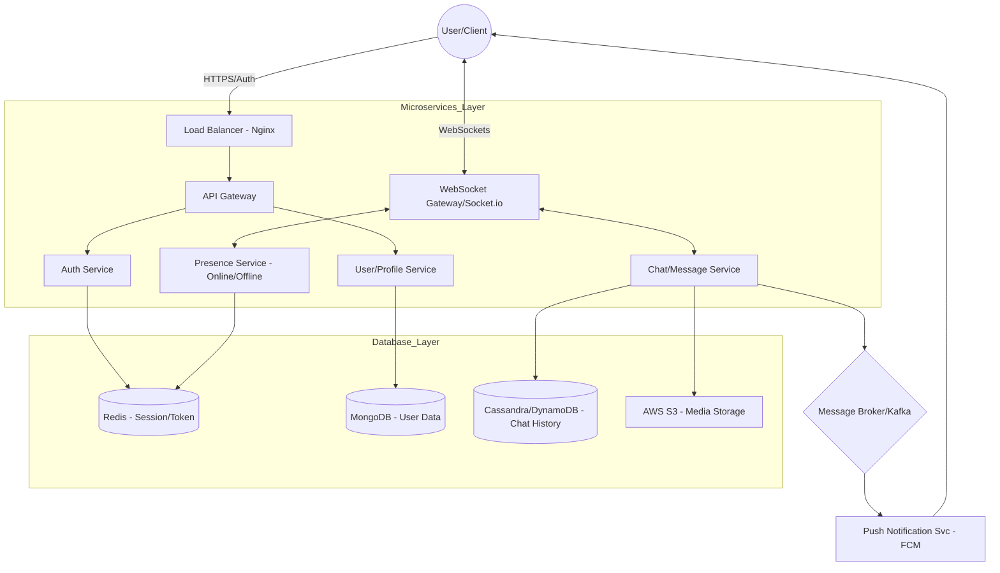

# 🔐 Secure Authentication System

A production-ready, full-stack authentication system built with **Next.js 15**, **Express.js**, and **MongoDB**. Features robust security controls including HTTP-only cookies, session management, and race condition handling.

## 🚀 Deployed Links

| Component | URL | Status |
|--------------|----------------------------------------------------------------------------------------------|-----------|
| **Frontend** | [https://secure-auth-system-ochre.vercel.app](https://secure-auth-system-ochre.vercel.app)   | ✅ Live   |
| **Backend**  | [https://secure-auth-system-s6ez.onrender.com](https://secure-auth-system-s6ez.onrender.com) | ✅ Live   |

> **⚠️ Note:** The backend is hosted on Render's **Free Tier**, which spins down after inactivity. The **first request may take 50-60 seconds** to process while the server wakes up. Please be patient! ⏳

---

## 🛠️ Project Setup

### **Prerequisites**
- Node.js (v18+)
- MongoDB Atlas Account
- SendGrid Account (for emails)

### **1. Backend Setup**
```bash
cd backend
npm install

# Create .env file
cp .env.example .env
# Fill in your MONGODB_URI, ACCESS_TOKEN_SECRET, REFRESH_TOKEN_SECRET, SENDGRID_API_KEY, etc.

# Start server
npm run dev
```

### **2. Frontend Setup**
```bash
cd frontend
npm install

# Create .env.local file
cp .env.local.example .env.local
# Add NEXT_PUBLIC_API_URL=http://localhost:5000 (Backend URL)

# Start development server
npm run dev
# Frontend will be running at http://localhost:3000
```

---

## 🔄 Authentication Flow

The system implements a secure, stateful authentication flow using JWTs and Cookies:

1.  **Registration**:
    - User submits email/password.
    - Backend hashes password (bcrypt) and creates user with `isEmailVerified: false`.
    - Generates a verification token and sends email via **SendGrid**.

2.  **Email Verification**:
    - User clicks link in email (`/verify-email?token=xyz`).
    - Backend validates token and updates user to `isEmailVerified: true`.

3.  **Login**:
    - User attempts login with credentials.
    - **Rate Limiting**: Check limits (5 attempts/15 min).
    - Backend validates credentials.
    - **Session Creation**:
        - Generates `accessToken` (short-lived) and `refreshToken` (long-lived).
        - Creates a `Session` document in MongoDB with device metadata.
        - Sets secure, HTTP-only cookies for tokens.

4.  **Protected Requests**:
    - Frontend sends cookies with every request.
    - Middleware validates `accessToken`.
    - If expired, uses `refreshToken` to rotate tokens (see Race Condition Handling).

---

## 🛡️ Session Management Strategy

We use a **hybrid approach** combining database-backed sessions with stateless JWTs for optimal security and control.

### **Key Components:**
-   **Database Sessions (`Session` Model)**:
    -   Tracks active logins per user.
    -   Stores `userId`, `refreshToken`, `userAgent`, `ipAddress`, and `lastActive`.
    -   **Benefit**: Allows admins or users to "Revoke Session" or "Log out all devices" remotely.

-   **JWT Tokens**:
    -   **Access Token**: Short lifespan (15 min), holds permissions.
    -   **Refresh Token**: Longer lifespan (7 days), used to get new access tokens.

-   **Security Controls**:
    -   **HTTP-Only Cookies**: Prevents XSS attacks (JS cannot read tokens).
    -   **Secure Flag**: Cookies only sent over HTTPS.
    -   **SameSite=None**: Allows cross-origin requests between Vercel (frontend) and Render (backend).

---

## 🏎️ Handling Race Conditions

Token rotation (refreshing tokens) is susceptible to race conditions when multiple requests hit the backend simultaneously with an expired access token.

**Our Solution:**
1.  **Atomic Database Operations**:
    -   We use MongoDB's `findOneAndUpdate` to handle token reuse detection.
    -   If a refresh token is used more than once (a sign of theft or race condition), the system **invalidates the entire session family**.

2.  **Token Rotation Strategy**:
    -   When a refresh token is used, it is **consumed** and replaced with a new one.
    -   The old refresh token is marked as invalid or removed from the whitelist.
    -   If the old token is presented again, it triggers a security alert and revokes all sessions for that user.


### **Rate Limiting Configuration**

| Endpoint                    | Action           | Limit          | Window         | Lockout Behavior  
|-----------------------------|------------------|----------------|----------------|--------------------------------------------------|
| `/api/auth/login`           | Login Attempts   | **5** requests | **15** minutes | Blocks IP for 15 mins. Returns dynamic countdown. |
| `/api/auth/register`        | Registration     | **3** requests | **1** hour     | Blocks IP for 1 hour. Returns dynamic countdown. |
| `/api/auth/forgot-password` | Password Reset   | **3** requests | **1** hour     | Blocks IP for 1 hour. Returns dynamic countdown. |

---

## 🏗️ Architecture Overview

### **Technology Stack**
-   **Frontend**: Next.js 15 (App Router), TypeScript, Tailwind CSS, Zustand (State Management), Axios.
-   **Backend**: Node.js, Express.js, MongoDB (Mongoose).
-   **Infrastructure**: Vercel (Frontend Hosting), Render (Backend Hosting), MongoDB Atlas (Database).

### **Security Architecture**
-   **CORS**: Strictly configured to allow only the frontend domain.
-   **Input Validation**: All inputs sanitized and validated to prevent Injection attacks.
-   **Rate Limiting**: Implemented on sensitive endpoints using `express-rate-limit` with dynamic countdowns.


## 📐 System Architecture Diagram ( Secure Auth System MERN Stack )

Explore the detailed architecture and flow diagrams in our system design document :  
👉 **[View Full System Design Diagram (Draw.io)](https://drive.google.com/file/d/1sXbXolrH1gQEvuU-TOW44u_RTVLi9txL/view?usp=sharing)**


## 💬 Chat System Architecture (Design Only)

Explore the detailed architecture and flow diagrams in our system design document :  
👉 **[View Full Chat System Diagram (Draw.io)](https://drive.google.com/file/d/1zNtvQ02iux35TlhHd7BY-jw85OtXdJC7/view?usp=sharing)**

As per the internship assignment specific requirement, here is the architectural design for a real-time chat application similar to WhatsApp.



### **1. High-Level Architecture**
-   **Frontend**: React Native (Mobile) / Next.js (Web) with secure local storage (SQLite/IndexedDB).
-   **Load Balancer**: Nginx to distribute WebSocket connections.
-   **API Gateway**: Handles authentication, REST API requests, and routing.
-   **Chat Service**: Node.js + Socket.io clusters (stateful) for real-time messaging.
-   **Presence Service**: Redis-based service to track Online/Offline/Typing status.
-   **Push Notification Service**: Firebase Cloud Messaging (FCM) for offline alerts.
-   **Database**:
    -   **MongoDB**: For user profiles and chat metadata.
    -   **Cassandra/ScyllaDB**: For high-volume message storage (write-heavy).
    -   **Redis**: For caching and pub/sub.

### **2. Communication Method: WebSockets vs REST**
-   **WebSockets (Socket.io)**: Primary method. Used for real-time bi-directional events (sending messages, typing indicators, read receipts).
    -   *Why?* REST polling is too slow and resource-heavy for real-time chat.
-   **REST API**: Used for non-real-time actions (uploading media, fetching old chat history, updating profile settings).

### **3. Database Schema Design**

#### **Users Collection (MongoDB)**
```json
{
  "_id": "uuid",
  "phone": "+1234567890",
  "publicKey": "base64_key",
  "lastSeen": "timestamp"
}
```

#### **Conversations Collection (MongoDB)**
```json
{
  "_id": "chat_id",
  "participants": ["user_id_1", "user_id_2"],
  "type": "one_to_one"
}
```

#### **Messages Table (Cassandra)**
```sql
CREATE TABLE messages (
  conversation_id uuid,
  message_id timeuuid,
  sender_id uuid,
  content text,
  status text, -- sent, delivered, read
  created_at timestamp,
  PRIMARY KEY (conversation_id, created_at)
) WITH CLUSTERING ORDER BY (created_at DESC);
```

### **4. Message Delivery Flow**
1.  **Sent**: User A sends message via WebSocket → Server saves to Cassandra (Status: `sent`) → Ack sent to User A.
2.  **Delivered**:
    -   If User B is **Online**: Server pushes via WebSocket → User B device sends Ack → Server updates DB to `delivered` → User A notified.
    -   If User B is **Offline**: Server pushes to FCM (Push Notification) → stored in "Unread Queue" in Redis.
3.  **Read**: User B opens chat → Client sends "Read Ack" → Server updates DB to `read` → User A notified.

### **5. Online/Offline & Synchronization**
-   **Presence**: When WebSocket connects/disconnects, update Redis `SET user:status "online"`. Heartbeat mechanism (ping/pong) ensures stale connections are removed.
-   **Multi-Device Sync**:
    -   Everything is synced via a **Sync Log**.
    -   When a device comes online, it requests "all events after timestamp X".
    -   Server fetches missed messages from Cassandra and replays them.

### **6. Scalability & Failure Handling**
-   **Horizontal Scaling**: Chat servers are stateless regarding user data but stateful regarding connections. Use **Redis Pub/Sub** to broadcast messages across different server instances.
-   **Failure Handling**:
    -   **Message Queue (Kafka/RabbitMQ)**: Used to buffer messages if the DB is under load.
    -   **Retry Mechanism**: Client implements exponential backoff retry for failed messages.


## 👤 Author

Project Name: **Secure Auth System**  
Created by: Ranjit Jana  
Assignment for: **Kalp Intelligence Internship**  
Evaluator: **Aman Sharma**
